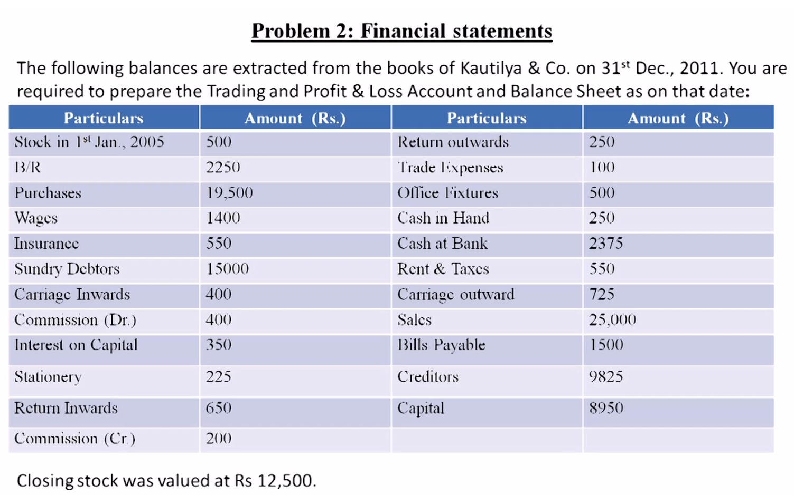

# Financial Statements: Trading and Profit & Loss Account

This lecture illustrates how to prepare a trading account and a profit and loss account. A trading account determines **gross profit**, while a profit and loss account determines **net profit** after indirect incomes and expenses.

## Example 1: Alfa Associates

### Trading Account

**Trading Account of Alfa Associates for the year ending XXXX**

| Particulars (Dr.) | Inner Amount (₹) | Amount (₹) | Particulars (Cr.) | Inner Amount (₹) | Amount (₹) |
| --- | ---: | ---: | --- | ---: | ---: |
| To Opening Stock of Raw Material | — | 24,000 |  |  |  |
| To Purchases Less: Purchase Returns | 91,300 4,000 | 87,300 | By Sales Less: Sales Returns | 160,000 5,000 | 155,000 |
| To Wages | — | 18,100 | By Closing Stock | — | 22,100 |
| To Factory Rent | — | 3,000 |  |  |  |
| To Freight on Purchases | — | 3,000 |  |  |  |
| To Gross Profit c/d | — | 41,700 |  |  |  |
|  |  | **177,100** |  |  | **177,100** |

### Profit and Loss Account

| Debit (Dr.) | Amount (₹) | Credit (Cr.) | Amount (₹) |
| --- | ---: | --- | ---: |
| Office rent | 20,000 | Gross profit b/d | 41,700 |
| Freight on sales | 1,500 | Discount received from creditors | 1,100 |
| Salaries | 6,000 |  |  |
| General expenses | 4,500 |  |  |
| Discount allowed to customers | 1,800 |  |  |
| Net profit before tax | 9,000 |  |  |
| **Total** | **42,800** | **Total** | **42,800** |

If corporate tax is ₹3,000, the net profit after tax is **₹6,000** (₹9,000 − ₹3,000).

## Example 2

### Trading Account

| Particulars (Dr.) | Inner Amount (₹) | Amount (₹) | Particulars (Cr.) | Inner Amount (₹) | Amount (₹) |
| --- | ---: | ---: | --- | ---: | ---: |
| To Opening Stock | — | 500 |  |  |  |
| To Purchases Less: Return Outwards (Purchase Returns) | 19,500 250 | 19,250 | By Sales Less: Sales Returns | 25,000 650 | 24,350 |
| To Wages | — | 1,400 | By Closing Stock | — | 12,500 |
| To Carriage Inwards | — | 400 |  |  |  |
| To Gross Profit c/d | — | 15,300 |  |  |  |
|  |  | **36,850** |  |  | **36,850** |

### Profit and Loss Account

| Debit (Dr.) | Amount (₹) | Credit (Cr.) | Amount (₹) |
| --- | ---: | --- | ---: |
| Insurance | 550 | Gross profit b/d | 15,300 |
| Commission expense | 400 | Commission received | 200 |
| Interest on capital | 350 |  |  |
| Stationery | 225 |  |  |
| Trade expenses | 100 |  |  |
| Rent and taxes | 550 |  |  |
| Carriage outwards | 725 |  |  |
| Net profit after tax | 12,600 |  |  |
| **Total** | **15,500** | **Total** | **15,500** |

The ₹550 for rent and taxes includes the tax expense. Therefore, ₹12,600 is the **net profit after tax**.

## Key Terms

- **Return outwards**: Purchase returns—goods returned to suppliers.
- **Return inwards**: Sales returns—goods returned by customers.
- **Carriage/freight inwards**: A direct expense related to acquiring goods; it appears in the trading account.
- **Carriage/freight outwards**: An indirect selling expense; it appears in the profit and loss account.

## Scope of the Trading and Profit and Loss Account

The trading and profit and loss account is a **nominal account**. It includes incomes and expenses only. Assets and liabilities are considered separately when preparing the balance sheet.

Examples of assets include bills receivable, sundry debtors, cash in hand, and cash at bank. Examples of liabilities include bills payable, creditors, and capital.
